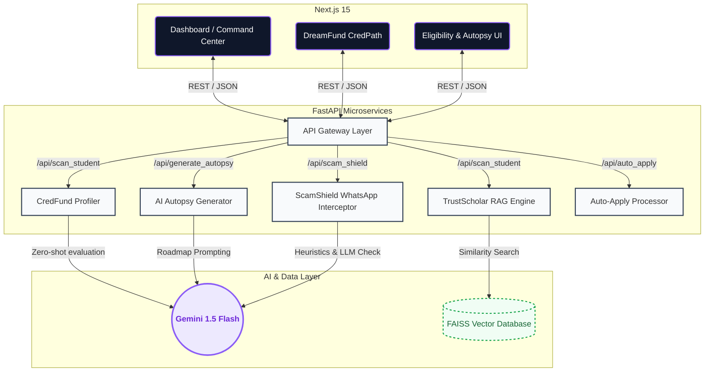
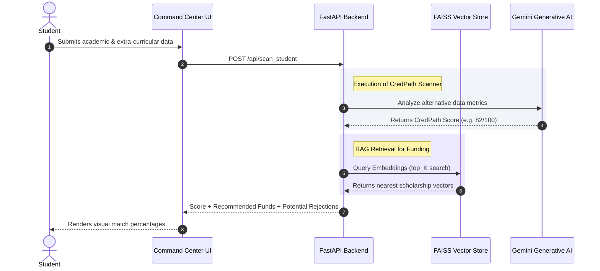
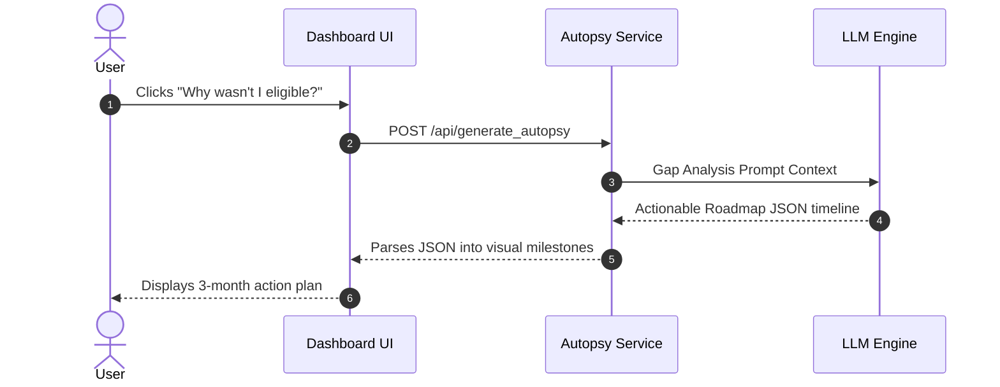
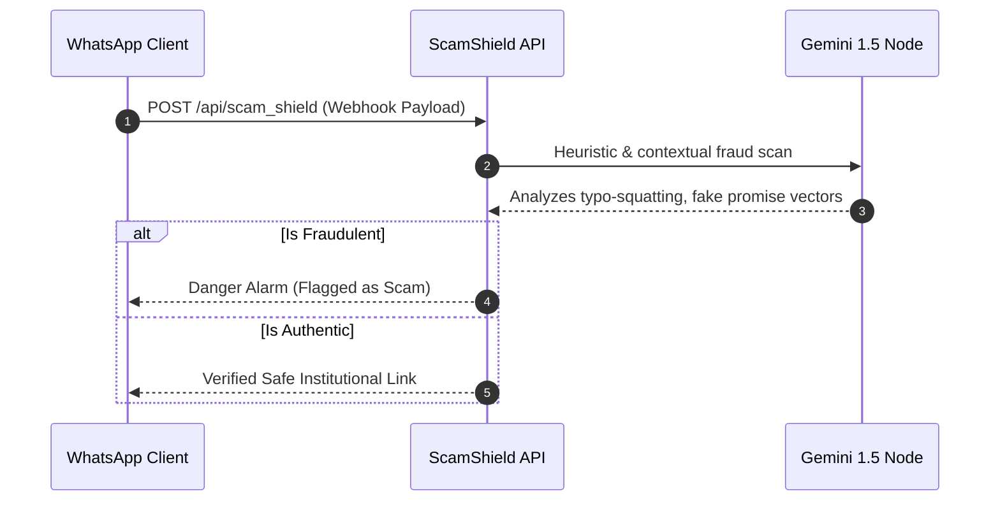

<div align="center">
  
  
  <h1 align="center">DreamFund AI Ecosystem</h1>
  <p align="center">
    <strong>Agentic Credit Intelligence & Verified Scholarship Matching</strong>
    <br/>
    Next-Gen infrastructure to democratize education funding through alternative scoring, autonomous RAG agents, and real-time scam detection.
  </p>

  <p align="center">
    <a href="#-system-architecture">Architecture</a> •
    <a href="#%EF%B8%8F-core-workflows">Workflows</a> •
    <a href="#-technical-stack">Tech Stack</a> •
    <a href="#-api-reference">API Overview</a> •
    <a href="#-getting-started">Getting Started</a>
  </p>
</div>

<br/>

## 🌟 Overview

DreamFund is an integrated **AI-Driven Financial Agent Ecosystem**, engineered to redefine how students build credit profiles, access funding, and protect themselves from predatory educational scams. 

By unifying **Alternative Credit Scoring**, **RAG-powered Scholarship Matching**, and **Real-time Cybersecurity diagnostics**, DreamFund bridges the gap between unbanked students and global financial institutions.

### Core Pillars
1. **TrustScholar (Agentic Hub):** FAISS-powered semantic RAG engine navigating thousands of scholarship datasets, predicting approval odds through student embeddings.
2. **CredFund Scanner:** Deep-context AI pipeline that evaluates non-traditional data points (Github, Hackathons, Academic performance evolution) to generate a proprietary *CredPath Score*.
3. **ScamShield:** WhatsApp-integrated Gemini zero-shot engine evaluating suspicious links or forwarding campaigns, neutralizing Ed-tech phishing instantly.
4. **Auto-Apply & AI Autopsy:** Autonomous application workflows with an *AI Autopsy* capability generating custom roadmaps for students who narrowly miss scholarship requirements.

---

## 🏗 System Architecture

DreamFund operates on a modern decoupled architecture: a high-performance **Next.js 15 Client Layer** and a **FastAPI Microservices Backend** powered by offline vector FAISS search and Gemini Large Language Models.



---

## ⚙️ Core Workflows

### 1. Alternate Credit Scoring & Matching
How an unbanked student acquires an eligibility score and gets matching scholarships through offline embeddings.



### 2. AI Autopsy & Corrective Roadmap
When a student almost qualifies, the AI Autopsy creates a strategic actionable plan.



### 3. ScamShield WhatsApp Protection
A dedicated microservice stopping social engineering attacks on applicants.



---

## 💻 Technical Stack

### **Frontend Ecosystem**
- **Framework:** Next.js 15 (App Router, React 19)
- **Styling:** Tailwind CSS
- **Interactivity:** Framer Motion (fluid transitions, agentic visual terminals)
- **Iconography:** Lucide React

### **Backend & AI Architecture**
- **Web Framework:** FastAPI (Async / REST)
- **AI Processing:** Google Generative AI (Gemini 1.5 Flash)
- **Vector Search Engine:** FAISS (Facebook AI Similarity Search)
- **Embeddings:** `sentence-transformers`
- **Data Pipeline:** Python Data Structures, Pandas, Pydantic 

---

## 🔌 API Reference

| Endpoint | Method | Internal Role | Target Payload |
|----------|--------|---------------|----------------|
| `/api/scan_student` | `POST` | Generates CredPath score + returns RAG matches | `tenth_marks`, `twelfth_marks`, `tier`, `purpose` |
| `/api/auto_apply` | `POST` | Simulates an automated profile fill | `provider_name`, `student_name` |
| `/api/generate_autopsy`| `POST` | Creates an LLM roadmap for rejected applications | `provider_name`, `profile_summary` |
| `/api/scam_shield` | `POST` | Identifies predatory ed-tech logic | `message_text`, `forward_count` |

---

## 🚀 Getting Started

### 1. Clone the repository
```bash
git clone https://github.com/SIBAM890/DreamFund.git
cd DreamFund
```

### 2. Backend Initialization (API + AI Node)
Requires **Python 3.10+**. Used for all vector fetching and scanning logic.
```bash
cd backend
python -m venv venv

# Activate venv
# On Windows: venv\Scripts\activate
# On Mac/Linux: source venv/bin/activate

pip install -r requirements.txt
```
Configure your environment constants inside the `backend/` directory:
```env
# backend/.env
GEMINI_API_KEY="AIzaSy...your_gemini_api_key_here"
```
Launch the microservice endpoint:
```bash
uvicorn main:app --reload --host 0.0.0.0 --port 8000
```

### 3. Frontend Initialization (Client Terminal)
Requires **Node.js 18+**. Ensure you open a separate independent terminal instance.
```bash
cd frontend-main
npm install
npm run dev
```
Navigate to [`http://localhost:3000`](http://localhost:3000) to launch the centralized dashboard.

---

> **Note on Security**: DreamFund is designed to maximize local boundaries. FAISS embedding searches rely on local indexed files rather than external calls. Any outbound interaction with LLMs strips or encrypts Personal Identifiable Information (PII) before transmission.
